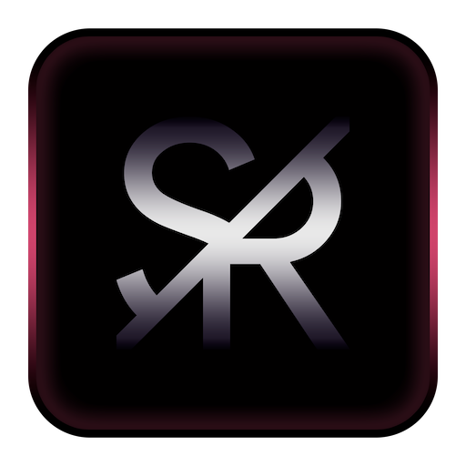

# NSR - Screen Recorder - Cross-Platform Video Capture [1.8.2]

NSR - Screen Recorder - Cross-Platform Video Capture allows you to easily record your application's screen in Unity. The plugin provides an api for recording video on iOS, Android, Windows, macOS and is a cross-platform solution.

The plugin has the ability to record any camera layer!

High-Speed: Engineered and extensively optimized for superior performance.

Capture Everything! Capture any visual content that can be transformed into a texture, whether it's a gaming interface, user interface, camera feed, or texture.

Tailored Resolutions: Capture videos with resolutions as high as Full HD (1920x1080) or even higher if your device supports it.

Augmented Reality Support: The package provides complete compatibility with ARFoundation, ARCore, ARKit, and Vuforia.

Concurrent Recording: The package ensures thread safety, enabling recording in worker threads to enhance performance even further.

Share utility: With this utility, you can easily share any files and folders.

Gallery utility: It's a simple and convenient way to save content to your target device.

File manager utility: Manage files from any of your storage locations with ease.

Lightweight Integration: The API is purposefully designed to minimize unnecessary additions or extra burden on your project.

Supported platforms: iOS, Android, Windows, macOS

Highlights
• Easy API for Recording Video
• Full source code is included.
• Share any files
• Save pictures and videos to the Gallery

Feature set
• Watermark
• Share any files
• Audio recorder
• Save pictures and videos to the Gallery
• Simple file manager
• Render Texture support
• HDR (high dynamic range) support
• Screen Record with microphone
• Preview Recorded Video
• Get recorded file path
• Save recorded video
• Pause/Resume video recorder
• Automatically pause/resume video recording during program focus/pause
• Custom frame rate
• Edit recorded video (iOS Native Framework)